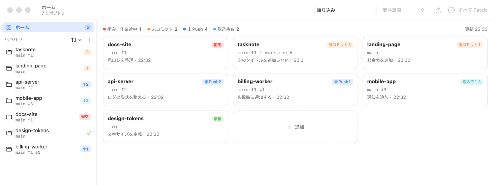
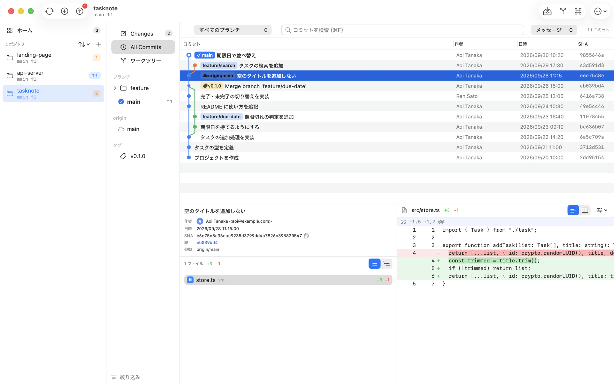

# Yohaku for Git

**頭の中に、余白を。** Mac 用の Git クライアントです。

どのリポジトリが未 Push だったか。AI エージェントがどこで何をコミットしたか。覚えておくのは Yohaku に任せて、頭はコードのために空けておけます。

## ダウンロード

**[最新版をダウンロード（Yohaku.dmg）](https://github.com/mashihara/yohaku/releases/latest/download/Yohaku.dmg)**　無料

DMG を開き、Yohaku を「アプリケーション」フォルダへドラッグしてください。Apple の公証（notarization）済みです。

- 紹介ページ: https://mashiharalab.dev/yohaku
- 動作環境: macOS 14 以降（Apple シリコン / Intel）
- `git` が必要です。入っていない場合は、初回に macOS が「コマンドライン・デベロッパ・ツール」のインストールを案内します

## こんなときに

- 「あれ、これ Push したっけ？」 いくつものリポジトリを行き来していて、未コミット・未 Push の変更を取り残しがち
- 「AI が何をしたのか、追いきれない」 Claude Code などの AI エージェントが、自分でブランチを切り、コミットし、ワークツリーまで作る
- 「ワークツリーが、増え続けている」 どれが作業中で、どれを消してよいのか分からない

## できること

### ホーム ― 全部のリポジトリを、ひと目で

登録したリポジトリの状態（衝突・作業途中、未コミット、未 Push、取込待ち）をカードで並べ、手を付けるべきものから順に表示します。何もないリポジトリは「最新」とだけ出ます。プロジェクトをまとめたフォルダを選べば、中のリポジトリをまとめて登録できます。

### 本物の git ― ターミナルとも AI とも、食い違わない

表示も操作もすべて Mac に入っている `git` コマンドで行い、リポジトリについて独自のデータを持ちません。ターミナルで打ったコマンドも、AI エージェントが裏で行ったコミットも、そのまま画面に現れます。開いているリポジトリはファイルの変更を見張っていて、表示が自動で追いつきます。`~/.gitconfig`・SSH 鍵・認証の設定もそのまま使います。

### ワークツリー ― AI の作業場所も、片付けまで

置き場所（`.claude` の中、隣のフォルダなど）、未コミット・未マージの変更の有無、最後に使った時期を一覧にします。作業が残っていないものは、まとめて削除できます。

### 変更 ― 差分を見ながら、行単位でコミット

ファイル・ハンク・行の単位でステージ。AI が書いたコードも、読んでから自分の手で取り込めます。Amend、コミットと同時に Push も。

### そのほか

- **ブランチ操作**: マージ、リベース、インタラクティブリベース、チェリーピック、リバート、リセット
- **リモート**: Fetch / Pull / Push（`--force-with-lease`、自動スタッシュ）
- **履歴**: ブランチの絞り込み、メッセージ・作者・コード内容での検索、2つのコミットの比較、ファイル履歴、Blame
- **その他**: スタッシュ、タグ、衝突の解決、クイック起動（⌘P）

主なショートカットは Fork と同じです（⌘1 変更、⌘2 全コミット、⇧⌘F/L/P Fetch/Pull/Push など）。

## 名前について

書や絵の「余白（よはく）」は、ただの描き残しではなく、主役を引き立てるためにあえて残しておく場所です。Git クライアントも主役ではありません。主役はあなたのコードと考えごと。Yohaku は Git の状態を覚えておく役目を引き受けて、頭に余白をつくります。画面も同じ考えで、色が付くのは気にすべきものだけにしています。

## よくある質問

- **無料ですか？** はい、無料です。
- **外部と通信しますか？** Yohaku 自体は通信しません（Fetch や Push など、`git` が行う通信を除く）。利用状況の収集もしていません。
- **なぜ App Store にないのですか？** App Store のアプリはサンドボックスの中で動くため、Mac の `git` コマンドや `~/.gitconfig`・SSH 鍵を使えません。本物の `git` をそのまま使うために、App Store の外で配布しています。

## English

**Make room in your head.** Yohaku ("blank space" in Japanese) is a free Git client for macOS. It shows the state of all your repositories at a glance — uncommitted, unpushed, behind, conflicted — and lists worktrees, including ones created by AI agents such as Claude Code, so you can clean up the idle ones. It runs the real `git` command under the hood, so it always agrees with what you or your AI agent do in the terminal. Requires macOS 14 or later (Apple silicon / Intel). The UI is in Japanese.

## 不具合の報告

[Issues](https://github.com/mashihara/yohaku/issues) へお寄せください。

© 2026 mashiharalab
